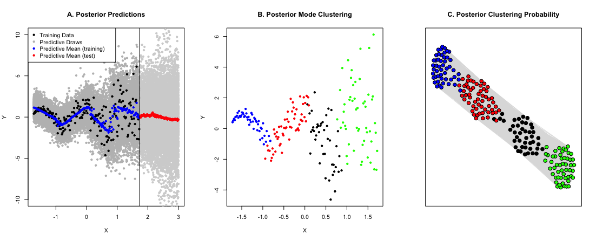

# Summary
`ChiRP` is a Monte Carlo Markov Chain (MCMC) implementation of **Chi**nese **R**estaurant **P**rocess (CRP) mixtures in `R`. CRP mixtures [@ferguson1973, @blackwell1973] are a class of Bayesian nonparametric models that can be used for robust regression modeling and clustering problems.

These are common tasks in biomedical research. However, regression often involves parametric assumptions (e.g. normality, linearity, constant variance). Similarly, clustering often involves pre-specifying the number of clusters - typically unknown to the researcher. Flexible machine learning methods exist for such problems, but they focus on predictive accuracy, making them inadequate for biomedical research applications where inference and interval estimation are of interest.

CRP mixtures work by partitioning a dataset into similar clusters - each associated with a locally parametric regression model. Unlike traditional clustering procedures, CRP mixtures allow for infinitely many clusters - thus side-stepping the need to pre-specify the number of clusters. Predictions are formed by ensembling over the local cluster-specific regression models. This fully Bayesian procedure produces an entire posterior distribution for both the cluster assignments and predictions - allowing for both point and interval estimation. 

# Outcome Types and Model Output
Suppose we are given training data with $n$ subjects $D_T=(Y_i, X_i)_{i=1:n}$. Here, $Y_i$ is the scalar outcome/label and $X_i$ is a $p\times1$ vector containing either binary or continuous features. `ChiRP` trains a CRP model and yields the following:

1. In-sample posterior mean predictions $( \hat{Y}_{i} )_{i=1:n}$ from a nonparametric CRP regression of $Y$ on $X$.
2. Out-of-sample posterior mean predictions on an un-labeled test set $(\tilde{X}_i)_{1:m}$, $(\hat{\tilde{Y}}_i)_{i=1:m}$.
3. Latent posterior mode cluster membership for both training and testing subjects.

`ChiRP` is not limited to producing the posterior means and modes above. It returns a posterior distribution over each subject's predicted outcome and cluster membership - allowing the user to compute posterior point and interval estimates for any desired estimand of interest.

`ChiRP` implements different local cluster-specific regressions depending on the outcome type: 

1. Zero-inflated, semi-continuous outcomes are modeled using cluster-specific zero-inflated regressions [See @Oganisian2018]
2. Continuous outcomes are modeled using cluster-specific linear regressions [See @hannah2011].
3. Binary outcomes are modeled using cluster-specific logistic regressions.

# Simulated Example
The figure illustrates a CRP mixture of linear regressions using outcome data generated from a sine wave. The first panel shows a flexible posterior mean prediction in blue for in-sample data. Posterior mean prediction for the test set is shown in red. We plot 100 posterior draws from the predictive distribution for each $X_i$ to display the uncertainty around the posterior mean prediction. Percentiles of these draws can be used to form credible intervals around the predicted mean.

Panel B gives some intuition about why a locally linear regression works so well with such complex data. The CRP model induces a clustering of points that are similar to each other in terms the linear model parameters. The CRP discovers four distinct clusters - each with its own linear regression. These clusters are indicated by color. Predictions are generated by averaging predictions from these cluster-specific models.

Panel C represents each subject in the training set as a node in a graph. The line connecting any two nodes is inversely proportional to the posterior probability of two subjects being clustered together. Colors indicate the posterior mode assignment. For example, the blue and green points are almost never clustered together. From Panel B it is obvious why this is: the blue and green points are far apart in $(X,Y)$ space. Note that some black points in Panel C are very close to the red points. This indicates that cluster assignment for these subjects are highly uncertain. They could belong to the red group or black group with significant probability. These points are the same points in Panel B around $X=0$ - the boundary of red and black.

# Acknowledgements
This work was supported in part by Grant R01GM112327 from National Institute Of General Medical
Sciences. Thanks to Dr. Jason Roy for helpful discussions of underlying MCMC computations and to Nicholas Illenberger and Carolyn Lou for help with package branding.

# References
